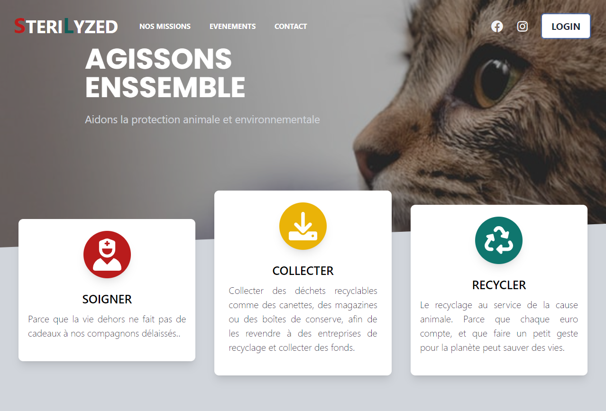
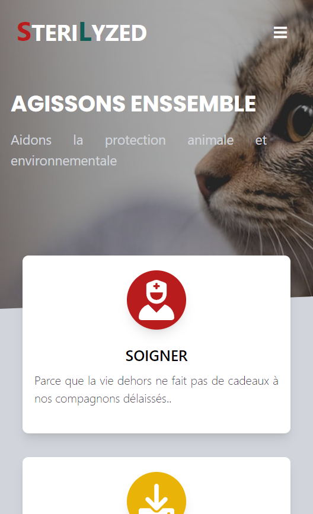

# Studi-GDW-fullStack-Eval-1-HTML-Tailwind

This is a solution to my [First Studi review - HTML-CSS-Framework ](a rajouter quand le site sera publié). 

## Table of contents

- [Overview](#overview)
  - [Evaluation subject](#specifications)
  - [Screenshot](#screenshot)
  - [Links](#links)
- [My process](#my-process)
  - [Built with](#built-with)
  - [What I learned](#what-i-learned)
- [Author](#author)


**Note: Delete this note and update the table of contents based on what sections you keep.**

## Overview

### Specifications

Create a showcase site for an association, whether real or fictional.
The site must contain :
- At least 2 pages
- A page relating to the association
- A nationwide event advertising page
- Make regular commits to git
- Use Html semantic structure and meta to optimize SEO

Of course the site will have to be responsive and at the request of the customer the interface will have to be designed mobile

### Screenshot




### Links

- Live Site URL: [Hebergé sur Vercel](https://#)

## My process

### Built with

- Semantic HTML5 markup
- Flexbox
- CSS Grid
- Mobile-first workflow
- [TailwindCSS][https://tailwind.com] - CSS Framework
- [Vanilla JS][http://vanilla-js.com/] - JS Native


### What I learned
I learned how to use tailwind's utility classes, in order to build a mobile-first page and then be able to reorganize the elements on larger screens

example for a simple button with change on a hover :
```html
<button 
class="inline-flex border-0 ring-2 py-1 px-4 text-black hover:text-white bg-white  
 hover:bg-black focus:outline-none rounded">
<a href="#">Button</a>
</button>
```

I also inserted some javascript, in particular to make the toggle on the menu button in mobile view

```js
function toggleNavbar(collapseID) {
    document.getElementById(collapseID).classList.toggle("hidden");
    document.getElementById(collapseID).classList.toggle("block");
  }
}
```

## Author
Cedric Le  Sergent 
- Website - [in construction](/#)


